# The Plant Base
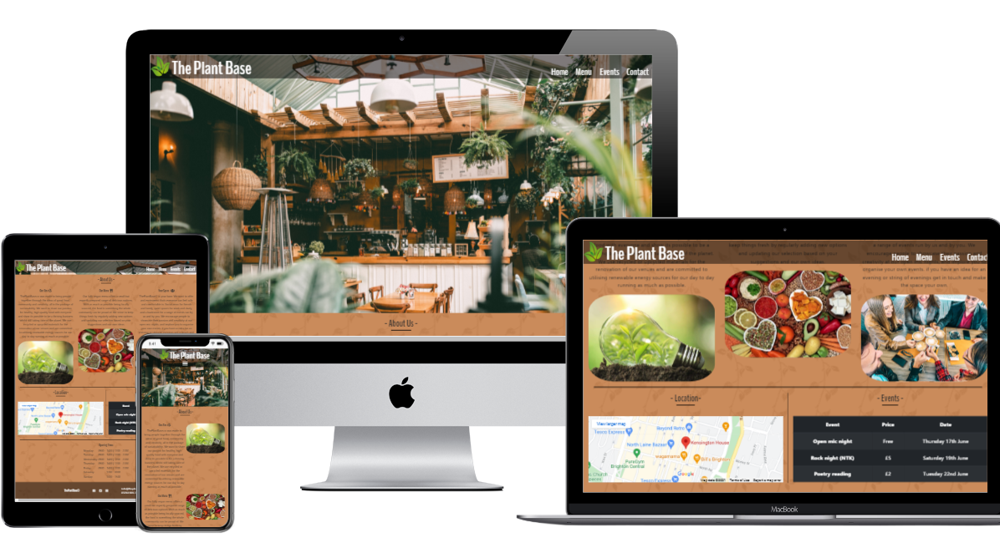
to view the full site [click here](https://ellis-robinson.github.io/ThePlantBase/index.html)

## __1. Purpose of the project__ 

 This project is the first milestone in my full stack developer course. Its intention is to showcase everything Ive learnt so far, in particular my understanding and ability to use HTML5 and CSS3 whilst focusing on the user experience. For this I have created a website for a fictional vegan cafe/ events venue called The Plant Base.
 
__Company objectives:__
* An online presence
* Get more customers
* Promote Sustainability
* Encourage meat free diets
* Provide a relaxing and enjoyable space
* Build and strengthen sense of community 

## __2. user stories__
 
 
a. As a visiting user I want to quickly and easily find essential information such as location and opening times.

b. As a visiting user I want to know what you are selling and how I can get
it.

c. As a visiting user I want to know what types of spaces and events there are so I can decide if I'm interested in going.

d. As a visiting user I want to see a list of events so I know what's happening when 

e. As a visiting user I want clear contact details so I can request any extra information I need.

## __3. Features__ 

### Home page 
+ Nav bar
  - Company name
  - Company logo
  - links to: Home, Menu, Events, Contact 
+ Image of cafe
+ "About us" section
  - Sub sections: Our Aim, Our menu, Your space
  - related images
+ Map showing location of venue
+ List of upcoming events
+ Opening times
+ Footer
  - copyright
  - links to socials
  - email and phone number
### Menu page
+ Nav bar
+ Menu with prices and allergy information
+ Footer
### Events page
+ Nav bar
+ 4 sections explaining the different events with times, prices and a photo 
  - food tasting
  - open mic nights
  - poetry reading 
  - your event
+ Footer
### Contact page
+ Nav bar
+ Contact from
  - contact details
    - First name 
    - Last name
    - email
    - phone number
    - Company 
  - request details
    - Type of request: host/book
    - date
    - additional info
    - submit button
+ confirmation of successful submit
+ Footer
### 404 page
+ Nav bar
+ friendly message and image 
+ Footer

## __5. Typography and colour scheme__ 

The main color was to be brown to symbolise the earth and rustic themes which ties in with our company aims and values. Colormind was used to select an initial color palate, then tweaked them using developer tools.
Eventually the lighter brown rgba( 200,133,83,0.95) was used for the background color, which i used as a semi transparent overlay for a repeating [vine pattern](assets/images/vine.jpg).
 
The nav bar text color is white over a semi transparent dark background. This allows the nav bar to maintain its contrast whilst identifying the links as clickable by distinguishing them from regular text.

General text color is a very dark grey #212529 to contrast enough with the light brown without being as jarring as solid black.

Event page text sections, are black over the solid version of the background brown #c88553 for extra contrast. 

The heading font is BenchNine from google fonts and was chosen to be clear and stylish without being too robotic. It comes in a light 300, regular 400 and bold 700 which allows for clear distinguishing between main headings and sub headings. 

## __6. wireframes__

I used balsamiq to create mock ups of the website, use the link to view them.
[The Plant Base wireframes](docs/README-images/wireframes/ThePlantBase.pdf)

## __7. Technology__

[Balsamiq](https://balsamiq.com/) -  This was used to create the wireframes for the projects

[HTML5](https://html5.org/)  -  The HTML pages were written using HTML5

[CSS3](https://www.css3.info/)  -  Each HTML page page was styles using CSS3

[Bootstrap](https://getbootstrap.com/) -  Bootstrap was used for some of the page structuring and other components

[fontawesome](https://fontawesome.com/) - Font awesome has a large library of icons, this was used to help identify certain sections of my website.

[Google maps](https://www.google.com/maps) – Good maps were used to embed a location into HTML page

[firefox](https://www.mozilla.org/en-GB/firefox/new/) – The project was completed using firefox browser. All development and testing was originally done on this browser before final testing on other browsers.

[google chrome](https://www.google.co.uk/intl/en_uk/chrome/) – chrome was one of the browsers used for testing compatibility after the completion of the project

[Microsoft edge](https://microsoftedgewelcome.microsoft.com/en-gb/) – Microsoft edge was one of the browsers used for testing compatibility after the completion of the project

[W3 code validator](https://validator.w3.org/)  -  This was used to check my code for any errors. All HTML and CSS pages were tested

[git hub](https://github.com/) – Github is where my repository for this project is stored, this Is also where the page was launched from.

[Git-pod](https://www.gitpod.io/) – through github I used gitpod for the actual coding of the website. 

## __8. Testing__

#### 8. 1 Code validation

+ All the HTML and CSS pages have been tested on [W3C](https://validator.w3.org/) and [jigsaw](https://jigsaw.w3.org/css-validator/).
screenshot links below.
  - [index.html](docs/README-images/validator-screenshots/w3v-index.png)
  - [menu.html](docs/README-images/validator-screenshots/w3v-menu.png)
  - [events.html](docs/README-images/validator-screenshots/w3v-events.png)
  - [contact.html](docs/README-images/validator-screenshots/w3v-contact.png)
  - [style.css](docs/README-images/validator-screenshots/w3c-css.png)

#### 8. 2 Accessibility

+ All pages were tested for Accessibility using [WAVE](https://wave.webaim.org/)
  1 error (empty table header) was detected and corrected.
  several contrast errors were detected and corrected.
  - [index.html](docs/README-images/wave-screenshots/wave-index.png)
  - [menu.html](docs/README-images/wave-screenshots/wave-menu.png)
  - [events.html](docs/README-images/wave-screenshots/wave-events.png)
  - [contact.html](docs/README-images/wave-screenshots/wave-contact.png)

#### 8. 3 User story test cases 

a. As a visiting user I want to quickly and easily find essential information such as location and opening times.

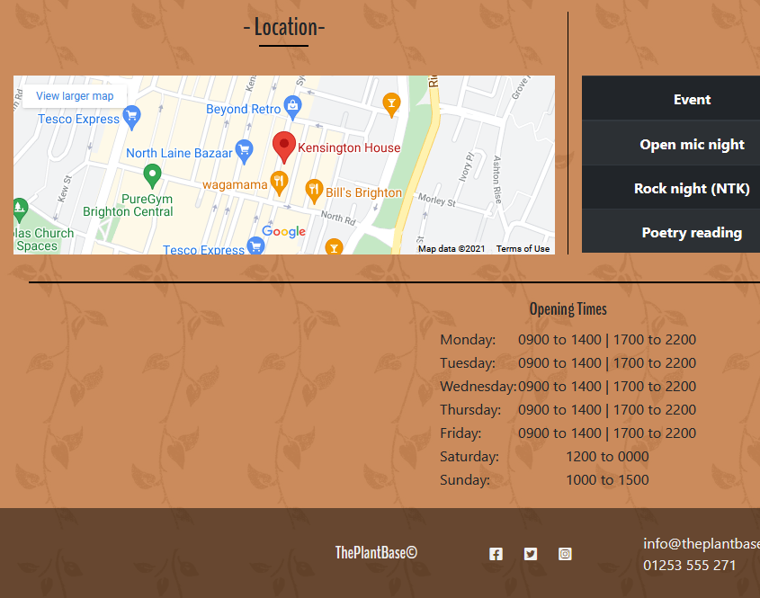

b. As a visiting user I want to know what you are selling and how I can get it.

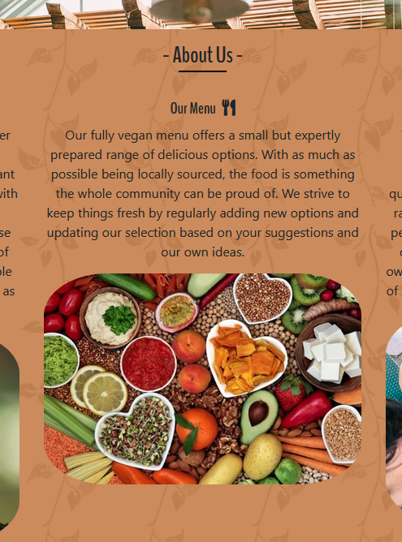
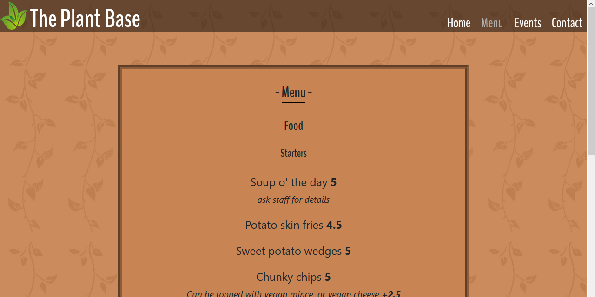

c. As a visiting user I want to know what types of spaces and events there are so I can decide if I'm interested in going.

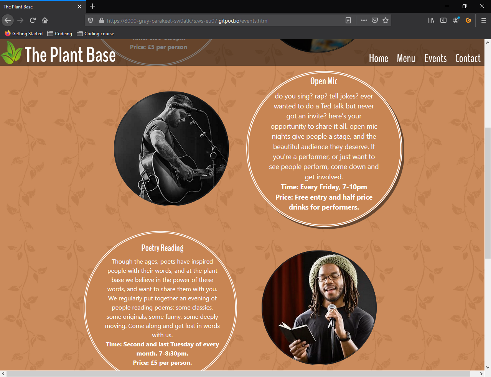

d. As a visiting user I want to see a list of events so I know what's happening when 

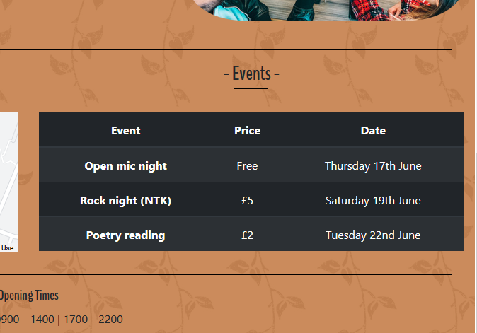

e. As a visiting user I want clear contact details so I can request any extra information I need.

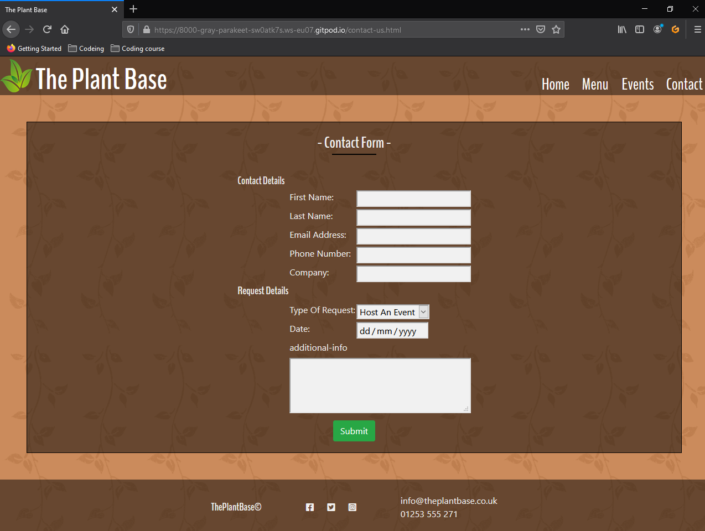

#### 8. 4 bugs and fixes

__Bug:__ .logo-brand stuck to left side of screen at smaller screen sizes.
 
__Fix:__ Changed display to flex and used justify content centre.

__Bug:__ Trying to align .nav-bar centrally when at smaller screen sizes but stuck over to right. Used flex in media query but wasn't working.
 
__Fix:__ Removed float attribute, which allowed flex to work.

__Bug:__ Cant get nav bar drop down menu to only show when in smaller screen sizes
 
__Fix:__ Copied code for nav-bar and embedded it into the .nav-bar-drop-down div. 
     set display styles to none/block appropriatly, so original nav-bar will stay hidden at smaller screen size and the embedded nav-bar will display when nav-bar-drop-down is hovered.

__Bug:__ Nav-bar-drop-down div is full width so nav bar opens up when hovering over anywhere on that line of page.
 
__Fix:__ Created div nav-bar-bars that surround fa-bars and nav-bar so nav bar only opens when nav-bar-bars is hovered.

__Bug:__ Small unwanted margin on right of screen
 
__Fix:__ Issue was due to bootstraps .row class, override it in my css by setting .row margins to 0

__Bug:__ Getting about us sub sections to be responsive and display inline at my custom screen brakes rather than using bootstraps preset ones.
 
__Fix:__ Override bootstraps .col-4 class buy setting flex and max-width to 100%. then set display to inline-flex. 
    added two divs to each sub sections to incorporate the heading and paragraph, and the image. then set max width of each to 50% 

__Bug:__ Wanted events text section to enlarge of hover.
 
__Fix:__ Originally; on hover set the individual width and height to slightly larger and the moved the position left and up, 
    and added box shadow to right and bottom to give the impression of zooming. 
    Then decided to use transition and transform, but still kept the box shadow, to get a smooth zoom effect.
    used [W3schools](https://www.w3schools.com/) for the necessary code.

__Bug:__ Events page sections too big for mobile screens, when made smaller the text was too long for container
 
__Fix:__ Used span in text to hide selected sentences at lower screen sizes

#### 8. 5 Supported screens ad browsers

I have tested the page for compatibility on firefox, google chrome and microsoft edge, 
as well as using the developer tools to check it across a variety of different phone and tablet screen sizes.
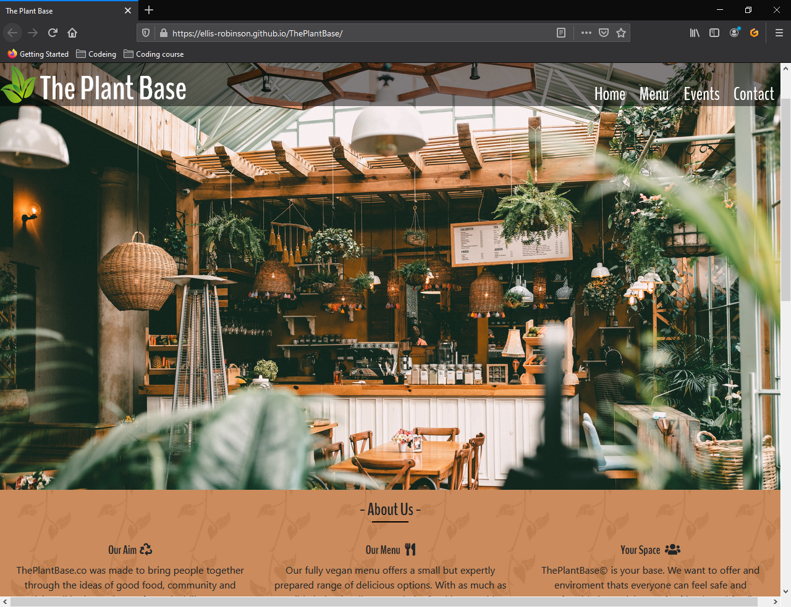
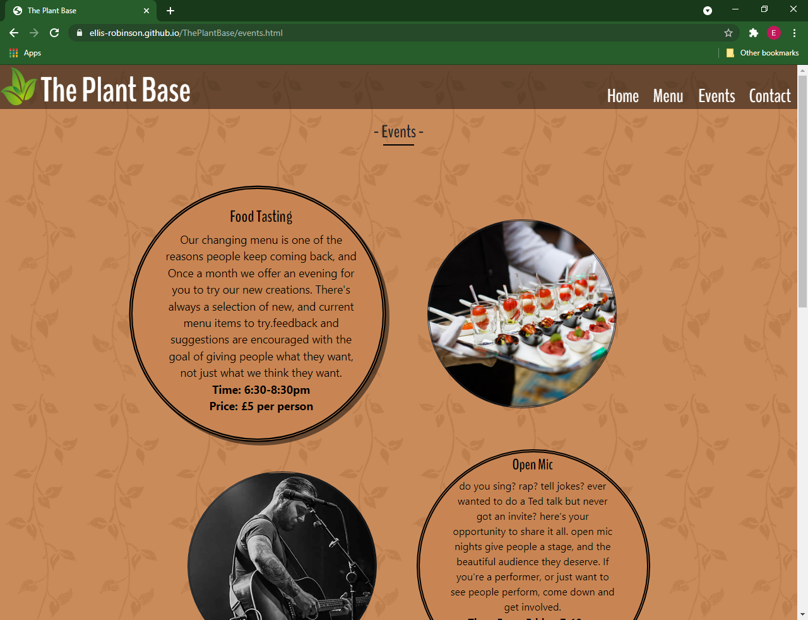
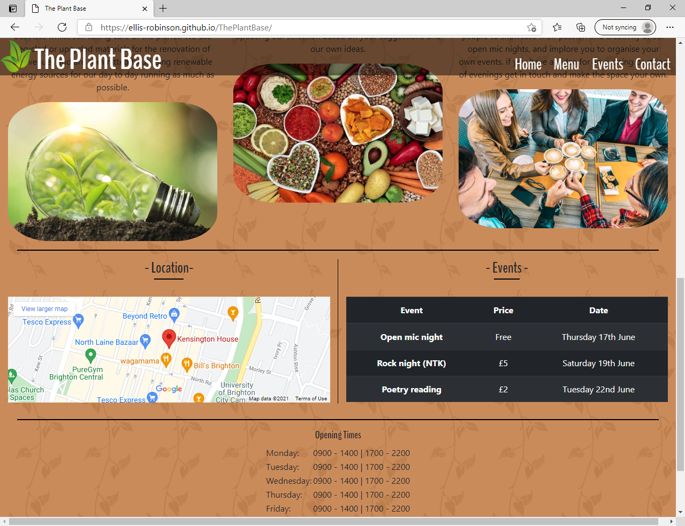
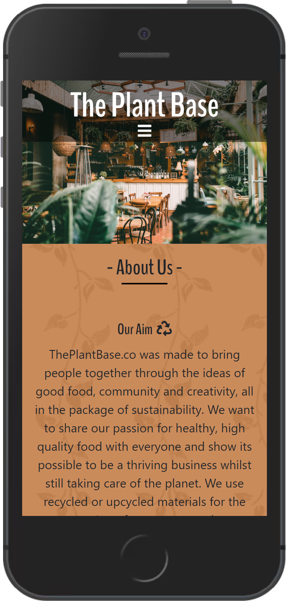
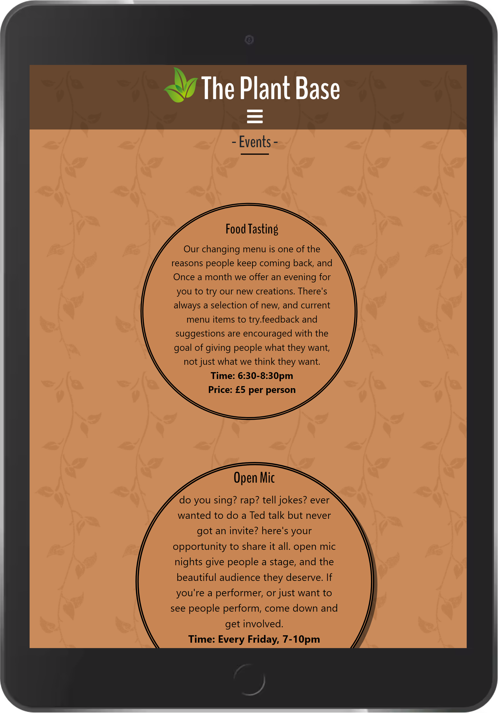

## __9. Deployment__

#### Github + Gitpod

Github is a code hosting platform that allows you to store your projects and collaborate with others. The process of creating a workspace is as follows:

1. open [github](https://github.com/) and either log in or create a profile.
2. create a new, or select a current, repository.
3. open a gitpod workspace by prefixing any GitHub URL with gitpod.io/#. or add the [gitpod browser extension](https://www.gitpod.io/docs/browser-extension/) which will automatically add this prefix for you.

[Gitpod](https://www.gitpod.io/) is the workspace where you write your code before saving and sending it back to your github repository for future use. The process for this is as follows:

in the control panel at the bottom of your workspace type in command:
1. **git add *{file name}*** - This adds selected files to staging area before committing.
2. **git commit -m *{"message stating updates made"}*** - This commits changes to local repository.
3. **git push** - This pushes committed files to github where they are stored for safe keeping.

*(optional) **git status*** - This shows you if you have anything left in the staging area or any un-pushed files. if this is clear then you can safely shutdown the local repository.

Deploying a page to github pages allows others to view your live website. 

1. log into **github**.
2. select desired **repository**.
3. select **settings**.
4. select **pages**.
5. in source drop-down menu select **master branch**.
6. select **save** and your website will be deployed and you will be shown the URL.

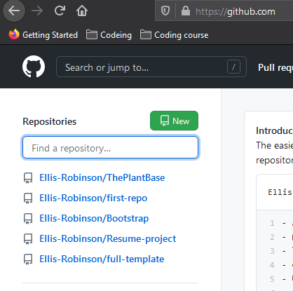
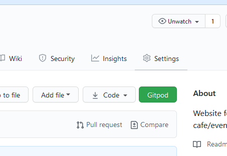
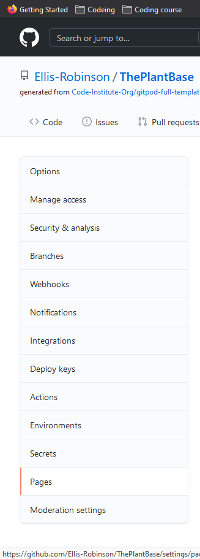
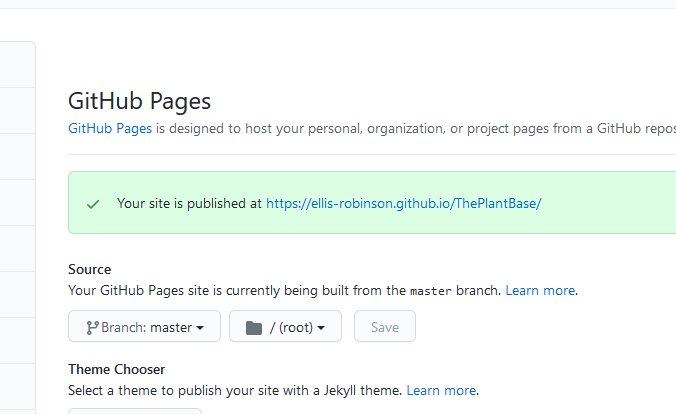

## __10. credits__

For general advice and reminders I used [W3schools](https://www.w3schools.com/) and [Stack overflow](https://stackoverflow.com/)

I utilised the Table, col and btn classes from [Bootstrap](https://getbootstrap.com/)

Used logos and symbols from [Font Awesome](https://fontawesome.com/) 

Changed hex colors into rgba using developer tools and [color-hex](https://color-hex.org/color/c88553)

The code for the copyright symbol came from [toptal](https://www.toptal.com/designers/htmlarrows/symbols/copyright-sign/)

#### images:

[hero image](assets/images/hero.jpg)- https://unsplash.com/@pinchebesu

[our menu](assets/images/high-protein-vegan-foods-1.jpg) - https://www.veganfriendly.org.uk/food-drink/high-protein-vegan-foods/

[your space](assets/images/coffee-cheers.jpg) - https://stock.adobe.com/in/search/images?k=coffee%20cheers

[our aim](assets/images/plant-bulb.jpg) - https://dentistry.co.uk/2020/07/14/can-make-dental-practice-sustainable/

[open mic](assets/images/open-mic3.jpg) - https://www.openmicuk.co.uk/advice/stockton-on-tees-open-mic-top-best-nights-near-me/

[food tasting](assets/images/food-tasting.jpg) - https://stock.adobe.com/tr/search/images?k=food%20tasting%20event

[your next event](assets/images/crowd.jpg) - https://www.shponline.co.uk/feature/understanding-crowds-and-crowded-space-issues/

[poetry reading](assets/images/stock-poet) - https://freebeacon.com/issues/taxpayers-billed-climate-change-poetry-lgbt-book-clubs-kids/

[logo](assets/images/logo.png) - https://www.pinclipart.com/maxpin/iTJxTmx/

